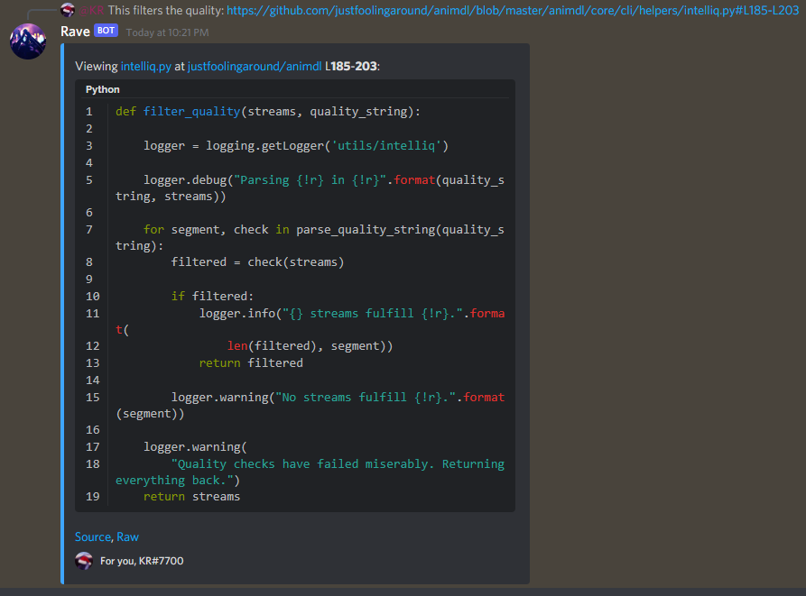

<h2 align="center">GitCord</h2>

<p align="center">Provide smart GitHub codeblocks to your Discord server.</p>
<p align="center">Be sure to give me ideas to make life easier in your Discord server using GitHub integrations.</p>

<h3 align="center">Usage</h3>

Simply just download / clone the repo, copy the folder `gitcord` to your bot's cogs' location.

For normal usage:

```py
import discord
from discord.ext import commands

bot = commands.Bot("!")

bot.load_extension("{directory}.{to}.gitcord")

bot.run("TOKEN")
```

<h3 align="center">Configuration</h3>

Your configuations need to be in a file named `gitcord.env`. This file needs to be in your `.` or root folder. All the options are kept as an example <a href="./gitcord.env.example">here</a>.

These are the explanation behind the configurations:

- `CODEWRITE_RATELIMIT_PER_SECOND`

    A specific ratelimit as to how often an user's message will get converted to codeblocks.

    If set to `10`, the only a single message every 10 seconds will get converted.

- `CODEWRITE_RATELIMIT_EXEMPTIONS`

    Discord User **ID** of individuals separated by commas. These people will not face any sort of ratelimits.

- `CODEWRITE_RATELIMIT_EXEMPTIONS_INVERT`

    Set to `1` for `true`, `0` for `false`. This inverts `CODEWRITE_RATELIMIT_EXEMPTIONS`. This means, only those people will face ratelimits while other people remain unaffected.

- `CODEWRITE_DOWNLOAD_LIMIT`

    By default set to 2MB or `2097152`, this is the file size limit for code downloads. This is set in `bytes`.

    If a file exceeds this size, it will get ignored.

- `CODEWRITE_EMBED_CODE_LIMIT`

    The limit of code that is to be shown inside the codeblocks. More code will get truncated **intelligently**.


<br>
<br>
<br>

<h2 align="center">Screenshots</h3>

<br>

<p align="center">
<code>

</code>
</p>
